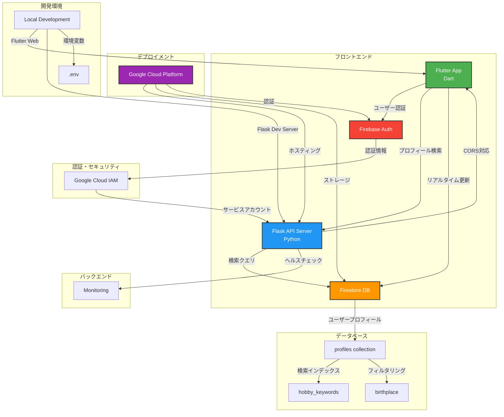
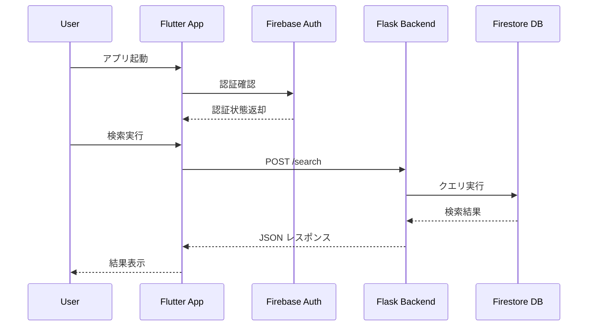

# Me-Too!（ミートゥー） アーキテクチャ図

## データフロー

## 技術仕様

### フロントエンド
- **技術**: Flutter (Dart)
- **プラットフォーム**: Web, iOS, Android
- **認証**: Firebase Auth
- **状態管理**: Provider/Riverpod

### バックエンド
- **技術**: Flask (Python)
- **API**: RESTful API
- **CORS**: 有効化済み
- **ポート**: 5000

### データベース
- **技術**: Firestore
- **コレクション**: profiles
- **インデックス**: hobby_keywords (配列), birthplace (文字列)

### 検索機能
- **趣味検索**: array_contains クエリ
- **出身地検索**: 完全一致クエリ
- **複合検索**: AND条件